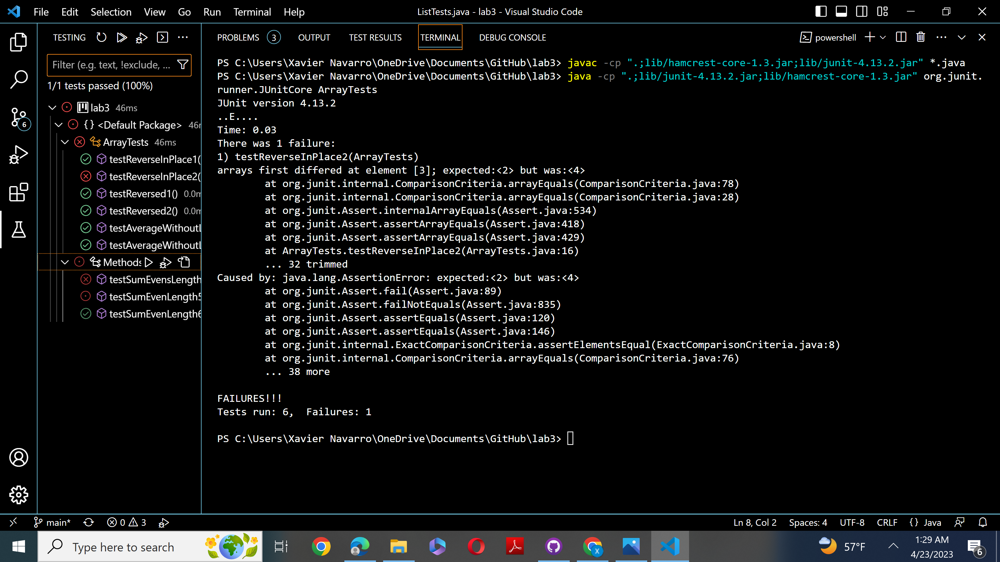

__Name: Xavier Navarro__

__CSE 15L Lab Report 2__

During week 2 lab, I learned about servers. Here is a short demonstration of how web servers work! 

__Part 1: StringServer__

Here is some code which adds strings over and over to a server using the ```\add-message?s=<string>``` as a path at the end of a url.
```
import java.io.IOException;
import java.net.URI;

class Handler implements URLHandler {
    String message = "";
    public String handleRequest(URI url) {
        if (url.getPath().equals("/")) {
            return String.format("%s", message);
        } else {
            System.out.println("Path: " + url.getPath());
            if (url.getPath().contains("/add")) {
                String[] parameters = url.getQuery().split("/");
                for (int i = 0; i < parameters.length; i++) {
                    String[] toAdd = parameters[i].split("=");
                    message = message + toAdd[1] + "\n";
                }
                return String.format("%s\n", message);
            }
            return "404 Not Found!";
        }
    }
}

class StringServer {
    public static void main(String[] args) throws IOException {
        if(args.length == 0){
            System.out.println("Missing port number! Try any number between 1024 to 49151");
            return;
        }

        int port = Integer.parseInt(args[0]);

        Server.start(port, new Handler());
    }
}
```

This code results in something like this happening...

.png)

As you can see, the main method in the ServerString class takes in a integer between 1024 and 49151 and forms a link to the created server. In this example, I chose 1235 which can clearly be seen through the url. This change happens when ```Server.start(port, new Handler());``` is called. 

You'll also notice that the string added to path specified earlier was added to the server itself. This occurs in the Handler class where the handleRequest method is called. It takes the url as an argument which in this case would be ```localhost:1235/add-messages?s=Hello```. In this code, the url is first split by ```/``` to isolate the path, then split by ```=``` to isolate the wanted term. This is then added to an empty string with the addition of ```\n``` to form a new line. When the site is updated, ```Hello``` will be shown on the server.

.png)

Similar to the first image, the same server is being used as the number after localhost is still the same.

Different from the first image though, you'll see that ```localhost:1235/add-messages?s=this_works!``` is in the url instead. Also, the server still keeps the value of ```Hello```. Taking in the same arguement as before, ```this_works``` is the term that we will be adding to the server. The term ```Hello``` is still here because the empty string we appended it to from the last step still contains it. Thus, after ```Hello```, we have ```this_works!``` added to a new line right below it.

__Part 2: Bugs__

The lab for week 3 was primarily focused on the utilization of JUnit and figuring out how to find bugs using it. 
Here is an example of a buggy program that needs tweaking...

_Buggy Code_
```
// Changes the input array to be in reversed order
  static void reverseInPlace(int[] arr) {
    for(int i = 0; i < arr.length; i += 1) {
      arr[i] = arr[arr.length - i - 1];
    }
  }
```
Here are some example inputs...

_Failure-Inducing Input_
```
@Test 
public void testReverseInPlace2() {
    int[] input1 = { 1,2,3,4,5 };
    ArrayExamples.reverseInPlace(input1);
    assertArrayEquals(new int[]{ 5,4,3,2,1 }, input1);
}
```
_Output_
```
arrays first differed at element [3]; expected:[2] but was:[4]
 at ArrayTests.testReverseInPlace2(ArrayTests.java:16)
Caused by: java.lang.AssertionError: expected:[2] but was:[4]
```

This code rightfully outputs an error. Notice how the error only occurs once we pass the halfway point of the array. The significance of this will be more clear once we see the proper fix to the code.

_Doesn't Induce Failure (BAD)_
```
@Test 
public void testReverseInPlace1() {
    int[] input1 = { 3 };
    ArrayExamples.reverseInPlace(input1);
    assertArrayEquals(new int[]{ 3 }, input1);
	}
```
With just an array carrying just the integer 3, running the code will pass the JUnit test. This can cause confusion on if your code works as intended. Some tests may pass but it doesen't mean that your code is bug free. This is an example of why you should use multiple tests to reduce the liklihood of missing faulty code.

_Symptom_
Here is a screenshot of how running the code will look on VSCode.



You can see that all but one tests passed. The one test that failed was the failure-inducing input shown earlier.

_Fixed Code_
```
static void reverseInPlace(int[] arr) {
    for(int i = 0; i < arr.length / 2; i += 1) {
      int temp = arr[i];
      arr[i] = arr[arr.length - i - 1];
      arr[arr.length - i -1] = temp;
    }
  }
```
One of the bugs that needed to be fixed was the code needed to run only to the middle index. If it ran all the way through, the needed change would be undone becasue once the code reached 4, it would be swapped with 2 again which impedes on the intended change. Also, there needs to be a temporary variable. This will allow us to properly change the value at ```arr[i]``` without losing the needed information needed to become equal to ```arr[arr.length - i - 1]```.

__Part 3: What did I Learn?__

Over these two labs, I would say I learned the most about servers and how they work. I already had some experience with JUnit in CSE 12 so I was already a little familiar with the approach I should take while debugging the code. Learning about servers on the other hand was much more confusing, but interesting to see how code directly interacts with a website controlled by a server.

